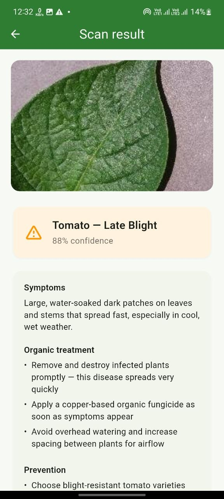
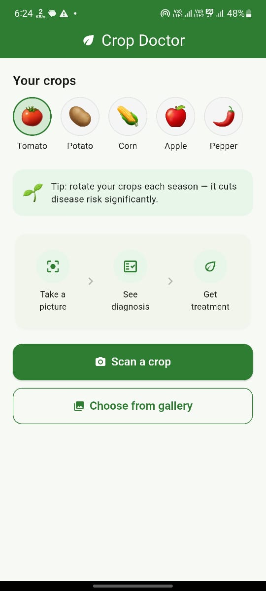
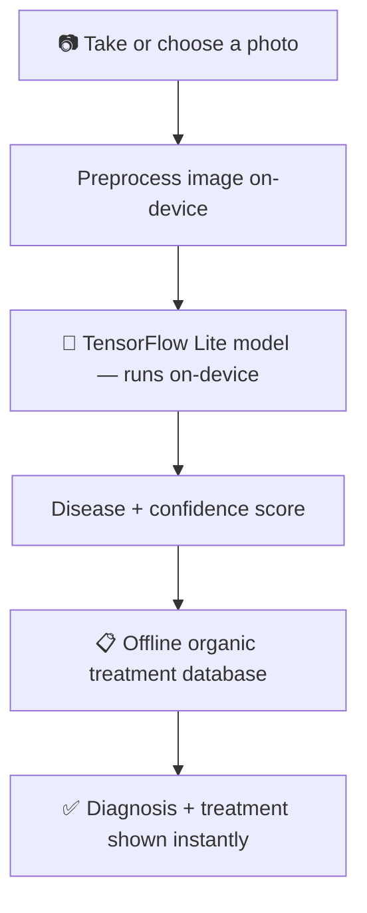

# 🌿 Crop Doctor — Offline Crop Disease Diagnostician

> Diagnose crop diseases from a smartphone photo and get an organic treatment plan — **100% offline, no internet required.**


Built for the problem statement:

> **Agriculture: Crop Disease Diagnostician** — Build an offline edge-AI or mobile solution to identify early-stage crop diseases from smartphone photos and recommend localized organic treatments.

---

## 🚜 The Problem

Millions of smallholder farmers lose part of their harvest every season to crop diseases that could have been treated early — if they'd been caught in time. Most existing crop-advisory apps depend on cloud AI, which means they're useless exactly where they're needed most: rural fields with poor or no internet connectivity. Many farmers also default to broad-spectrum chemical pesticides simply because they don't have easy access to organic alternatives.

## ✅ How Crop Doctor Solves It

| Requirement from the problem statement | How Crop Doctor delivers it |
|---|---|
| **Offline edge-AI / mobile solution** | A Flutter app running a quantized TensorFlow Lite model directly on the phone's processor — no cloud API, no server call. Verified working in Airplane Mode. |
| **Identify early-stage diseases from smartphone photos** | Camera or gallery capture → on-device classification in under a second, trained on real labeled disease images. |
| **Recommend localized organic treatments** | Every diagnosis is instantly matched against a bundled, fully offline database of organic-only remedies (neem oil, copper-based fungicides, crop rotation, sanitation) — no chemical pesticides. |

## ✨ Features

- 📷 **Instant photo diagnosis** — camera or gallery, no upload wait
- 🧠 **100% on-device AI** — no internet, no server, no API key, ever
- 🌱 **Organic-first treatment plans** — symptoms, remedies, and prevention for every result
- 🥦 **Multi-crop support** — Brinjal, Cabbage, Cauliflower, Peanut, Potato, Tomato (easily extendable)
- 🕘 **Local scan history** — every past diagnosis saved on-device, no account required
- 🧰 **Quick-access farming tools & library** — calculators and crop/disease reference sections
- 💚 **Clean, farmer-friendly UI** — built for usability across literacy and smartphone-experience levels

## 📱 Screenshots

<table>
<tr>
<td width="50%">

<p align="center"><em>Running live on a physical Android device</em></p>
</td>
<td width="50%">

<p align="center"><em>Home screen — crop selector, tip banner, and the take a picture → see diagnosis → get treatment flow</em></p>
</td>
</tr>
</table>

## 🏗️ How It Works



Every step above happens **on the phone itself** — there is no point in this pipeline where the app needs a network connection.

## 🧰 Tech Stack

| Layer | Tool | Why |
|---|---|---|
| App UI | **Flutter (Dart)** | Single codebase, native performance, rich widget library |
| On-device inference | **TensorFlow Lite** | Purpose-built for fast, offline mobile inference |
| Model training | **Google Teachable Machine** + transfer learning | Fast, free, no-code path to a working classifier |
| Training data | **PlantVillage dataset** | Free, public, ~54,000 labeled crop-disease images |
| Local storage | **SharedPreferences** | Offline scan history, zero backend required |

## 📂 Project Structure

```
lib/
  main.dart                        entry point
  theme/app_theme.dart             colors, buttons, cards
  models/                          data shapes (DiseaseResult, Treatment)
  services/
    inference_service.dart         mock AI (for fast UI development)
    tflite_inference_service.dart  real on-device AI
    treatment_service.dart         loads the offline treatment database
    scan_history_service.dart      local scan history (SharedPreferences)
  screens/
    main_shell.dart                bottom navigation shell
    home_screen.dart                capture screen + tools + history
    result_screen.dart              diagnosis + treatment screen
    placeholder_screen.dart         reusable "coming soon" screen
assets/
  data/treatments.json              offline disease + organic treatment database
  model/                            model.tflite + labels.txt (on-device AI model)
```

A key architectural decision: the AI layer sits behind an `InferenceService` interface, so the mock AI used during development and the real TensorFlow Lite model can be swapped with a single line change — no UI code depends on which one is active.

## 🌾 Supported Crops & Diseases

| Crop | Classes covered |
|---|---|
| Tomato | Early blight, Late blight, Leaf mold, Bacterial spot, Healthy |
| Potato | Early blight, Late blight, Healthy |
| Corn | Common rust, Northern leaf blight, Healthy |
| Apple | Scab, Black rot, Healthy |
| Pepper | Bacterial spot, Healthy |
| Brinjal | Leaf spot, Healthy |
| Cabbage | Black rot, Healthy |
| Cauliflower | Black rot, Healthy |
| Peanut | Early leaf spot, Healthy |

## 🚀 Getting Started

```bash
git clone <this-repo-url>
cd crop_doctor
flutter pub get
flutter run
```

By default the app runs with a lightweight mock AI so the full UI/UX flow works out of the box. To use the real on-device model, add your trained `model.tflite` and `labels.txt` to `assets/model/`, uncomment the corresponding lines in `pubspec.yaml`, and switch `MockInferenceService()` to `TFLiteInferenceService()` in `lib/screens/home_screen.dart`.

## 🔭 Roadmap

- [ ] Expand disease coverage per crop with larger training datasets
- [ ] Add regional language support for wider accessibility
- [ ] On-device disease severity trends over time per field
- [ ] Community and marketplace features (currently placeholder screens)

## 🙏 Acknowledgments

- [PlantVillage](https://plantvillage.psu.edu/) for open crop-disease image data
- [Google Teachable Machine](https://teachablemachine.withgoogle.com/) for accessible model training
- The Flutter and TensorFlow Lite open-source communities

## 📄 License

MIT — free to use, modify, and build on.
